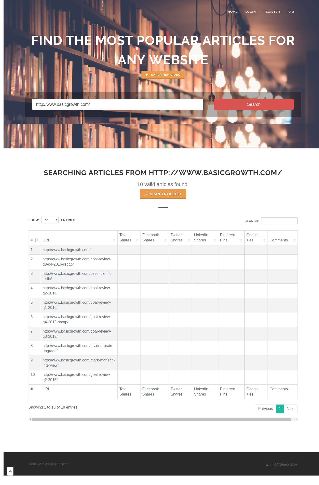
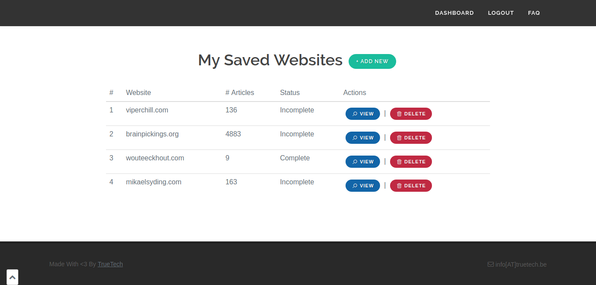
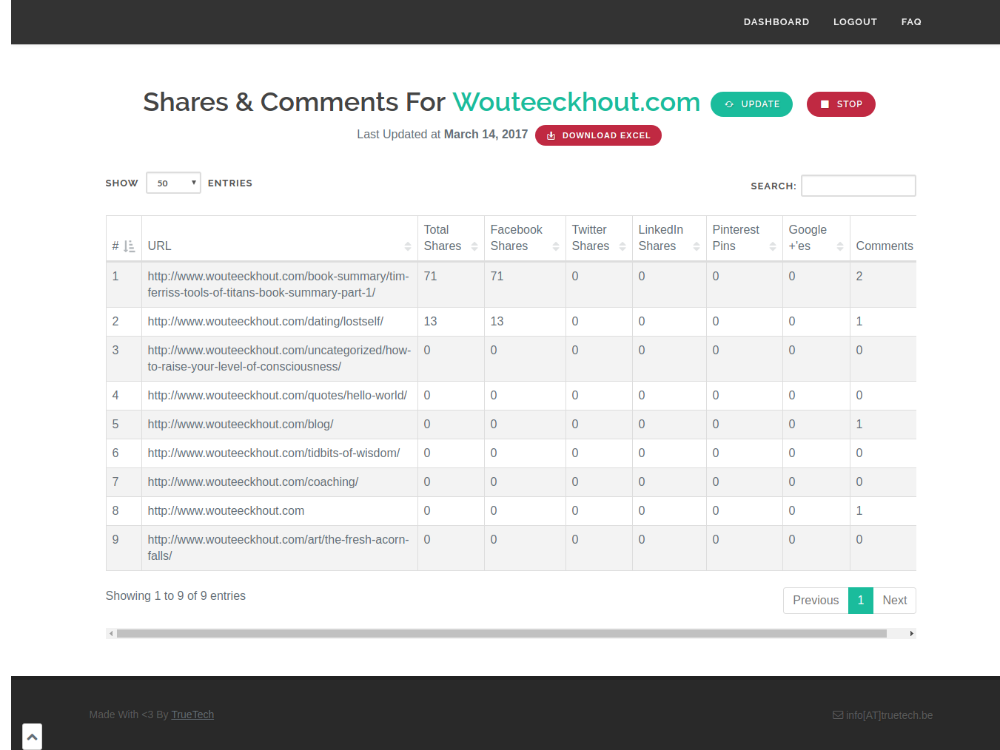
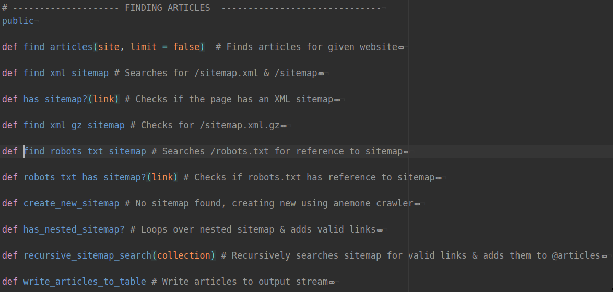
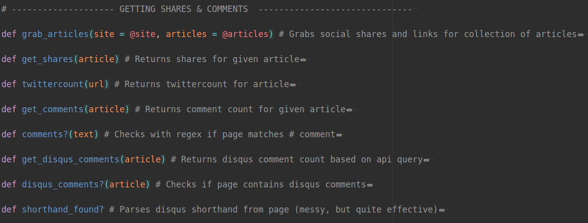
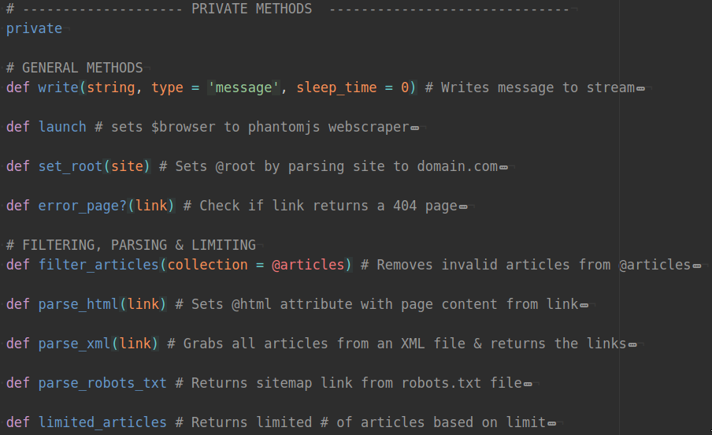

# Coach App

>ContenCrawler is an application that allows its users to retrieve the most popular articles from any website (measured by total social shares and comments). Might be down on occasion since it's running on free dynos.   

<b>User demo login:</b> demon@email.com & password  (Yeah, that's 'demon' instead of 'demo'. Typo :/) 

# Tech Stack

- <b>Front:</b> HTML, CSS, JS (+EventSource)
- <b>Back:</b> Ruby & RoR
- <b>Gems:</b> Typhoeus, watir, nokogiri, social_shares, phantomjs, activerecord-import, devise, open_uri, magic
- <b>Db:</b> Postgresql

# Pics Or It Didn't Happen

## Home Page

## Website Index

## Website Show

## Show Me Da Magic
<b> app/helpers/scraper_helper.rb</b>

# Explainer Video

<iframe width="560" height="315" src="https://www.youtube.com/embed/Z1w5bXbUS5w?list=PLGEw-EytTlW5GWyw4Ou6zrPrltMn7CpCJ" frameborder="0" allowfullscreen></iframe>

## TO DO

- Refactor messy javascript
- Implement ip rotation
- Find solution for facebook rape rate limiting
- Maybe try to actually market it a bit?  

Made with <3 by [TrueTech]("www.truetech.be/en")
